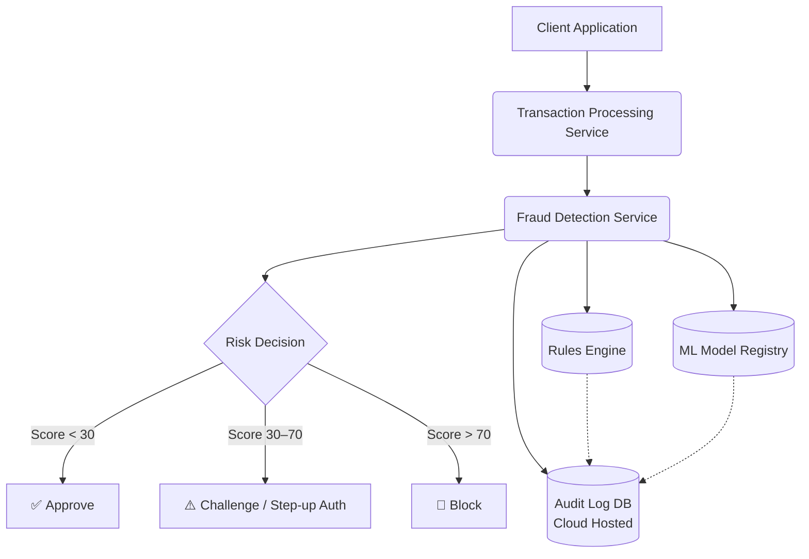

# Fraud Detection Service Documentation

Welcome to the technical documentation for the **Fraud Detection Service**, an internal platform component at Harness.

<!-- prettier-ignore -->
???+ info "What is this service?"
    The Fraud Detection Service evaluates financial transactions in real time, assigning risk scores and triggering automated actions — blocks, challenges, or approvals — to protect customers and the platform from fraudulent activity.

---

## 📚 Documentation Overview

- [Debugging & Runbooks](sub-page.md)
- [Code Examples](code-sample.md)
- [Rules & Extension Points](extensions.md)

---

## 🚀 What is the Fraud Detection Service?

<!-- prettier-ignore -->
??? note "Key Features"
    - **Real-time risk scoring** on every transaction
    - **Configurable rule engine** for business-defined thresholds
    - **ML model integration** for anomaly detection
    - **Automated decision actions**: approve, challenge, block
    - **Full audit trail** of every evaluation and decision

---

## 🗺️ System Architecture

Below is a high-level architecture diagram showing how the Fraud Detection Service integrates with the broader payments ecosystem:



---

## 🛠️ How to Use

1. **Install the client SDK** (internal package registry):

   ```bash
   npm install @harness/fraud-detection-client
   ```

<!-- prettier-ignore -->
??? tip "Need help with installation?"
    Make sure you have access to the internal npm registry. Contact the Harness Platform Engineering team if you encounter issues.

2. **Basic Usage Example:**

   ```typescript
   import { FraudDetectionClient } from '@harness/fraud-detection-client';

   const client = new FraudDetectionClient();

   const result = await client.evaluate({
     transactionId: 'txn_abc123',
     amount: 4500,
     currency: 'USD',
     userId: 'user_9821',
     merchantId: 'merch_441',
   });

   console.log('Risk score:', result.score);
   console.log('Decision:', result.decision); // APPROVE | CHALLENGE | BLOCK
   ```

<!-- prettier-ignore -->
???+ note "How do I get support?"
    You can get support by contacting the Harness Platform Engineering team or by visiting the [Debugging & Runbooks](sub-page.md) section.

---

## 🧑‍💻 When to Use This Service

- When you need **real-time fraud signals** before authorizing a transaction
- When you want to **enforce risk thresholds** without custom logic in each service
- When compliance requires a **full audit record** of every fraud evaluation

---

## 📝 Additional Resources

| Resource | Description |
|---|---|
| [Runbooks](sub-page.md) | Step-by-step guides for common debugging tasks |
| [Code Examples](code-sample.md) | Ready-to-use code snippets |
| [Rules & Extensions](extensions.md) | How to add custom rules or extend the scoring pipeline |

---

> _For questions or support, contact the Harness Platform Engineering team._

---

For more on TechDocs, see the [Harness IDP TechDocs Overview](https://developer.harness.io/docs/category/techdocs)
